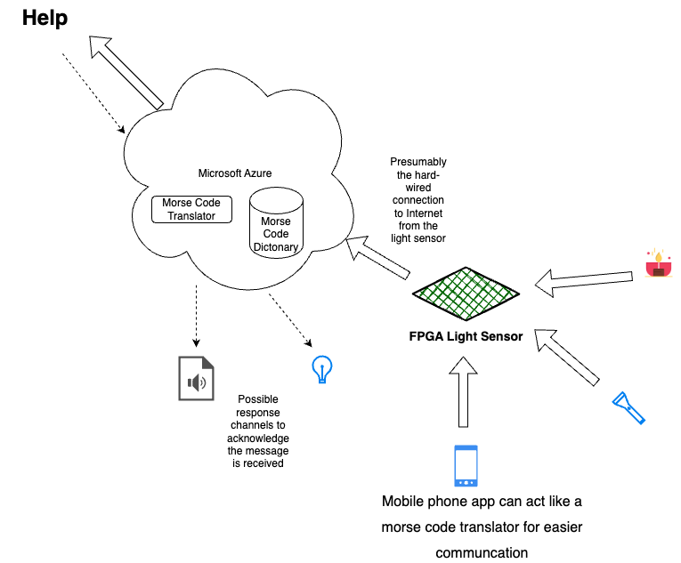

# illuminating-communication

Illuminating Communication Application (ICA)  is a communication system designed for the deaf that utilizes an FPGA-based light sensor to detect Morse code signals transmitted through light sources, such as a smartphone or flashlight. The system converts these Morse code signals into readable text, making it accessible to users without requiring Morse code knowledge. Moreover, the system leverages the Internet and cloud computing to widen the communication distance. It is intended to be deployed in public spaces, where sensors can detect and interpret light signals, and luminous tape can mark sensor locations to aid visibility in low-light areas. This application provides an alternative, reliable communication method in situations where standard devices or connectivity options are unavailable.

ICA process flow consists of

1. **Light Sensor Captures Signals**\
The light sensor attached to the DE10-Nano RFS card detects light fluctuations representing Morse code.
2. **Transmission to Azure IoT Hub**\
The light sensor data is transmitted from the DE10-Nano to Azure IoT Hub via a wired Internet connection (Ethernet).
3. **Data Reception at Azure IoT Hub**\
Azure IoT Hub receives the data from the DE10-Nano and passes it on for further processing.
4. **Converting light signals to Morse Code**\
Azure cloud services  (like Azure Functions or Stream Analytics) process the raw light signals and convert them into Morse code.
5. **Morse Code Decoding in Azure Cloud**\
Azure cloud services decode the Morse code into English language text.
6. **Triggering Azure Logic App**\
Once the Morse code is decoded, Azure Logic Apps or Azure Functions process the English text for delivery.
7. **Display, Voice, Send Email or Text to Human**\
The translated English message is displayed on screen(s), voice via speaker(s), sent via email or SMS to the intended human recipient using Azure Communication Services or other notification services.

